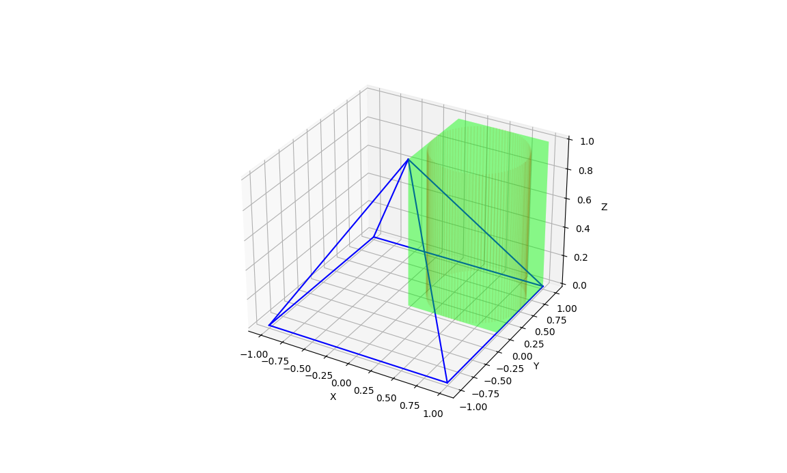

# Monte-Carlo-Estimation-of-Intersection-Volume

```markdown
# Monte Carlo Estimation of Intersection Volume

This project estimates the volume of the intersection of a rectangular box, a cylinder, and a square pyramid using the Monte Carlo method with a parallel computing approach.


## Introduction

The objective of this project is to estimate the volume of the intersection of three geometric shapes: a rectangular box, a cylinder, and a square pyramid. Analytical solutions for this problem are complex and often infeasible. Therefore, we use the Monte Carlo method, which provides an approximate but efficient solution through random sampling.

## Problem Description

We have three shapes in 3D space:
1. A rectangular box defined by its eight vertices.
2. A cylinder defined by the center points of its top and bottom faces and its radius.
3. A square pyramid defined by its five vertices.

The goal is to estimate the volume of the region where all three shapes intersect.

## Monte Carlo Method

The Monte Carlo method is a statistical approach that uses random sampling to estimate a result. Here’s how it works for our problem:
1. We define a bounding box that encompasses all three shapes.
2. We generate a large number of random points within this bounding box.
3. For each point, we check if it lies within all three shapes.
4. We calculate the proportion of points that fall within the intersection.
5. Finally, we estimate the volume of the intersection based on this proportion.

## Parallel Computing

To speed up the computation, we use parallel computing. This involves distributing the workload across multiple processors. In our implementation, we use Python's `multiprocessing` module to parallelize the point-in-shape checks. This significantly reduces the computation time, especially when dealing with a large number of random points.

## Code Implementation

### Importing Libraries

```python
import numpy as np
from multiprocessing import Pool
import matplotlib.pyplot as plt
from mpl_toolkits.mplot3d.art3d import Poly3DCollection
```

- **numpy (`np`)**: A library for numerical computations.
- **multiprocessing (`Pool`)**: A module to create a pool of worker processes for parallel execution.
- **matplotlib.pyplot (`plt`)**: A plotting library to create visualizations.
- **mpl_toolkits.mplot3d.art3d (`Poly3DCollection`)**: A module to create 3D polygons for visualization.

### Defining the Shapes

#### Function: `is_inside_box`

```python
def is_inside_box(point, vertices):
    min_x = min(vertices[:, 0])
    max_x = max(vertices[:, 0])
    min_y = min(vertices[:, 1])
    max_y = max(vertices[:, 1])
    min_z = min(vertices[:, 2])
    max_z = max(vertices[:, 2])

    return min_x <= point[0] <= max_x and min_y <= point[1] <= max_y and min_z <= point[2] <= max_z
```

- **Purpose**: Check if a point is inside a rectangular box.
- **Input**: `point` (a 3D point), `vertices` (an array of the box's vertices).
- **Output**: `True` if the point is inside the box, `False` otherwise.
- **Explanation**: Calculate the minimum and maximum coordinates of the box and check if the point lies within these bounds.

#### Function: `is_inside_cylinder`

```python
def is_inside_cylinder(point, c1, c2, radius):
    height_vector = c2 - c1
    height = np.linalg.norm(height_vector)
    axis = height_vector / height
    projection = np.dot(point - c1, axis)

    if projection < 0 or projection > height:
        return False

    perpendicular_vector = point - (c1 + projection * axis)
    distance = np.linalg.norm(perpendicular_vector)

    return distance <= radius
```

- **Purpose**: Check if a point is inside a cylinder.
- **Input**: `point` (a 3D point), `c1` and `c2` (center points of the cylinder's top and bottom faces), `radius` (radius of the cylinder).
- **Output**: `True` if the point is inside the cylinder, `False` otherwise.
- **Explanation**: 
  1. Calculate the height vector and axis of the cylinder.
  2. Project the point onto the axis.
  3. Check if the projection is within the height of the cylinder.
  4. Calculate the perpendicular distance from the point to the axis.
  5. Check if the distance is within the radius of the cylinder.

#### Function: `is_inside_pyramid`

```python
def is_inside_pyramid(point, vertices):
    apex = vertices[0]
    base_vertices = vertices[1:]

    if point[2] > apex[2]:
        return False

    def point_in_triangle(pt, v1, v2, v3):
        v1 = np.array(v1)
        v2 = np.array(v2)
        v3 = np.array(v3)
        pt = np.array(pt)
        v1v2 = v2 - v1
        v1v3 = v3 - v1
        v1p = pt - v1
        dot11 = np.dot(v1v2, v1v2)
        dot13 = np.dot(v1v2, v1v3)
        dot33 = np.dot(v1v3, v1v3)
        dot1p = np.dot(v1v2, v1p)
        dot3p = np.dot(v1v3, v1p)
        invDenom = 1 / (dot11 * dot33 - dot13 * dot13)
        u = (dot33 * dot1p - dot13 * dot3p) * invDenom
        v = (dot11 * dot3p - dot13 * dot1p) * invDenom
        return (u >= 0) and (v >= 0) and (u + v < 1)

    return (point_in_triangle(point[:2], base_vertices[0][:2], base_vertices[1][:2], base_vertices[2][:2]) or
            point_in_triangle(point[:2], base_vertices[0][:2], base_vertices[2][:2], base_vertices[3][:2]))
```

- **Purpose**: Check if a point is inside a square pyramid.
- **Input**: `point` (a 3D point), `vertices` (an array of the pyramid's vertices).
- **Output**: `True` if the point is inside the pyramid, `False` otherwise.
- **Explanation**: 
  1. Check if the point is below the apex.
  2. Use the barycentric coordinate method to check if the point lies within the base square, which is divided into two triangles.
  3. The `point_in_triangle` function checks if a point lies within a triangle using barycentric coordinates.

#### Function: `is_inside_all_shapes`

```python
def is_inside_all_shapes(point, box_vertices, cyl_c1, cyl_c2, cyl_radius, pyramid_vertices):
    return (is_inside_box(point, box_vertices) and
            is_inside_cylinder(point, cyl_c1, cyl_c2, cyl_radius) and
            is_inside_pyramid(point, pyramid_vertices))
```

- **Purpose**: Check if a point is inside all three shapes.
- **Input**: `point` (a 3D point), `box_vertices`, `cyl_c1`, `cyl_c2`, `cyl_radius`, `pyramid_vertices`.
- **Output**: `True` if the point is inside all shapes, `False` otherwise.
- **Explanation**: Combine the results of the individual point-in-shape checks.

### Monte Carlo Estimation

#### Function: `monte_carlo_estimation`

```python
def monte_carlo_estimation(num_points, box_vertices, cyl_c1, cyl_c2, cyl_radius, pyramid_vertices):
    bounding_box_min, bounding_box_max = calculate_bounding_box(box_vertices, cyl_c1, cyl_c2, cyl_radius, pyramid_vertices)
    points = np.random.rand(num_points, 3) * (bounding_box_max - bounding_box_min) + bounding_box_min

    with Pool() as pool:
        results = pool.starmap(is_inside_all_shapes, [(point, box_vertices, cyl_c1, cyl_c2, cyl_radius, pyramid_vertices) for point in points])

    volume_bounding_box = np.prod(bounding_box_max - bounding_box_min)
    volume_intersection = (sum(results) / num_points) * volume_bounding_box
    return volume_intersection
```

- **Purpose**: Perform the Monte Carlo estimation to estimate the volume of the intersection.
- **Input**: `num_points` (number of random points), `box_vertices`, `cyl_c1`, `cyl_c2`, `cyl_radius`, `pyramid_vertices`.
- **Output**: Estimated volume of the intersection.
- **Explanation**: 
  1. Calculate the bounding box.
  2. Generate random points within the bounding box.
  3. Use parallel processing to check if each point is inside all shapes.
  4. Calculate the volume of the intersection based on the proportion of points within the intersection.

#### Function: `calculate_bounding_box`

```python
def calculate_bounding_box(box_vertices, cyl_c1, cyl_c2, cyl_radius, pyramid_vertices):
    all_points = np.vstack([box_vertices, cyl_c1, cyl_c2, pyramid_vertices])
    min_bounds = np.min(all_points, axis=0)
    max_bounds = np.max(all_points, axis=0)

    min_bounds -= cyl_radius
    max_bounds += cyl_radius

    return min_bounds, max_bounds
```

- **Purpose**: Calculate the bounding box that encompasses all shapes.
- **Input**: `box_vertices`, `cyl_c1`, `cyl_c2`, `cyl_radius`, `pyramid_vertices`.
- **Output**: Minimum and maximum bounds of the bounding box.
- **Explanation**: 
  1. Stack all points into a single array.
  2. Calculate the minimum and maximum bounds.
  3. Adjust the bounds by the cylinder's radius.

### Visualization
!(https://raw.githubusercontent.com/rimu-7/Monte-Carlo-Estimation-of-Intersection-Volume/main/cylinder%26pyramid.png)
#### Function: `plot_shapes`

```python
def plot_shapes(box_vertices, cyl_c1, cyl_c2, cyl_radius, pyramid_vertices):
    fig = plt.figure()
    ax = fig.add_subplot(111, projection='3d')

    box_edges = [
        [box_vertices[i] for i in [0, 1, 5, 4]],
        [box_vertices[i] for i in [1, 2, 6, 5]],
        [box_vertices[i] for i in [2, 3, 7, 6]],
        [box_vertices[i] for i in [3, 0, 4, 7]],
        [box_vertices[i] for i in [0, 1, 2, 3]],
        [box_vertices[i] for i in [4, 5, 6, 7]]
    ]
    for edge in box_edges:
        poly = Poly3DCollection([edge], alpha=0.25)
        poly.set_facecolor((0, 1, 0, 0.1))
        ax.add_collection3d(poly)

    cyl_height = np.linalg.norm(cyl_c2 - cyl_c1)
    cyl_axis = (cyl_c2 - cyl_c1) / cyl_height
    theta = np.linspace(0, 2 * np.pi, 100)
    cyl_bottom = np.array([
        [cyl_c1[0] + cyl_radius * np.cos(t), cyl_c1[1] + cyl_radius * np.sin(t), cyl_c1[2]]
        for t in theta
    ])
    cyl_top = cyl_bottom + cyl_height * cyl_axis

    cyl_bottom_x, cyl_bottom_y, cyl_bottom_z = cyl_bottom.T
    cyl_bottom_z = cyl_bottom_z.reshape((1, -1))
    cyl_top_x, cyl_top_y, cyl_top_z = cyl_top.T
    cyl_top_z = cyl_top_z.reshape((1, -1))

    ax.plot_surface(cyl_bottom_x, cyl_bottom_y, cyl_bottom_z, color='r', alpha=0.1)
    ax.plot_surface(cyl_top_x, cyl_top_y, cyl_top_z, color='r', alpha=0.1)
    for i in range(len(cyl_bottom)):
        ax.plot([cyl_bottom[i, 0], cyl_top[i, 0]], [cyl_bottom[i, 1], cyl_top[i, 1]], [cyl_bottom[i, 2], cyl_top[i, 2]], color='r', alpha=0.1)

    pyramid_edges = [
        [pyramid_vertices[0], pyramid_vertices[i]] for i in range(1, 5)
    ] + [
        [pyramid_vertices[i], pyramid_vertices[i % 4 + 1]] for i in range(1, 5)
    ]
    for edge in pyramid_edges:
        ax.plot([edge[0][0], edge[1][0]], [edge[0][1], edge[1][1]], [edge[0][2], edge[1][2]], color='b')

    ax.set_xlabel('X')
    ax.set_ylabel('Y')
    ax.set_zlabel('Z')
    plt.show()
```

- **Purpose**: Visualize the shapes and their intersection.
- **Input**: `box_vertices`, `cyl_c1`, `cyl_c2`, `cyl_radius`, `pyramid_vertices`.
- **Output**: A 3D plot of the shapes.
- **Explanation**: 
  1. Create a 3D plot.
  2. Plot the box by defining its edges and adding them to the plot.
  3. Plot the cylinder by defining its bottom and top surfaces and adding them to the plot.
  4. Plot the pyramid by defining its edges and adding them to the plot.
  5. Set the axis labels and show the plot.

### Example Usage

```python
box_vertices = np.array([
    [0.0, 0.0, 0.0],
    [0.0, 1.0, 0.0],
    [1.0, 1.0, 0.0],
    [1.0, 0.0, 0.0],
    [0.0, 0.0, 1.0],
    [0.0, 1.0, 1.0],
    [1.0, 1.0, 1.0],
    [1.0, 0.0, 1.0]
])
cyl_c1 = np.array([0.5, 0.5, 1.0])
cyl_c2 = np.array([0.5, 0.5, 0.0])
cyl_radius = 0.5
pyramid_vertices = np.array([
    [0, 0, 1],
    [1, 1, 0],
    [-1, 1, 0],
    [-1, -1, 0],
    [1, -1, 0]
])

# Visualize the shapes
plot_shapes(box_vertices, cyl_c1, cyl_c2, cyl_radius, pyramid_vertices)

# Test points
test_points = np.array([
    [0.5, 0.5, 0.5],  # Inside the box
    [0.5, 0.5, 0.75],  # Inside the cylinder
    [0.0, 0.0, 0.5]    # Inside the pyramid
])



# Test is_inside_box
print("Box test:", [is_inside_box(point, box_vertices) for point in test_points])

# Test is_inside_cylinder
print("Cylinder test:", [is_inside_cylinder(point, cyl_c1, cyl_c2, cyl_radius) for point in test_points])

# Test is_inside_pyramid
print("Pyramid test:", [is_inside_pyramid(point, pyramid_vertices) for point in test_points])

# Estimate the volume of intersection
volume = monte_carlo_estimation(10000000, box_vertices, cyl_c1, cyl_c2, cyl_radius, pyramid_vertices)
print(f"Estimated volume of intersection: {volume}")
```

- **Purpose**: Demonstrate the usage of the functions and visualize the results.
- **Explanation**: 
  1. Define the vertices of the shapes.
  2. Visualize the shapes using the `plot_shapes` function.
  3. Test the point-in-shape functions with example points.
  4. Estimate the volume of the intersection using the `monte_carlo_estimation` function and print the result.

## Running the Code

1. **Save the Code**: Save the complete code in a Python file, for example, `ass.py`.
2. **Run the Code**: Open a terminal or command prompt and navigate to the directory where you saved the file. Run the code using the following command:

   ```bash
   python main.py
   ```

## Dependencies

- **Python**: Ensure you have Python installed (e.g., Python 3.6 or later).
- **Libraries**: Install the required libraries using `pip`:

  ```bash
  pip install numpy matplotlib
  ```

- **Virtual Environment** (Optional but Recommended): Use `venv` or `virtualenv` to create a virtual environment and install the required libraries within it.

  ```bash
  python -m venv myenv
  source myenv/bin/activate
  pip install numpy matplotlib
  ```

This `README.md` file provides a comprehensive overview of the project, explaining the code and how to run it. It should help anyone understand and use the code effectively.
